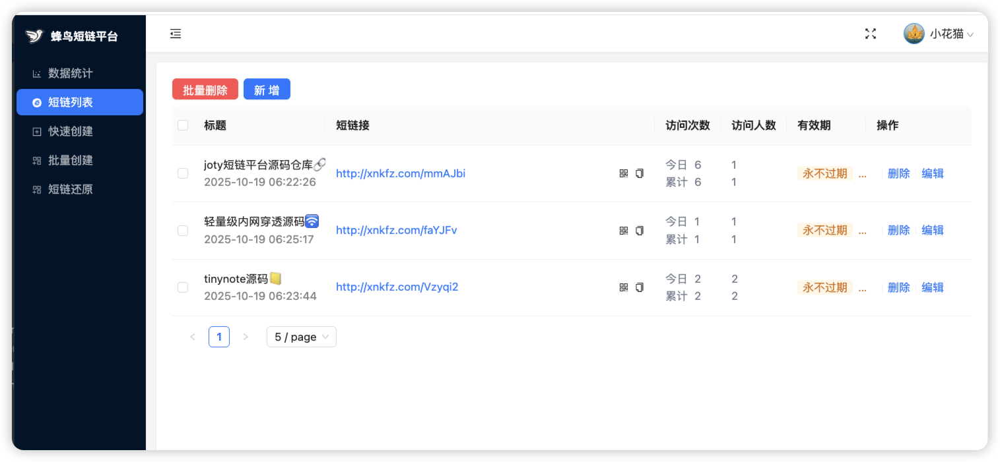

# 蜂鸟短链平台 

## 🚀线上预览
🔗访问地址：http://joty.xilio.cn （user:123456、user2:123456）

## 🛠️功能清单
- ✏️支持快速单个创建、批量创建、短链一键还原
- 🔋短链接可设置有效期，默认为永不过期
- 📱支持移动端扫描二维码访问
- 📉短链访问统计，访问人数采用IP纬度
- 🙈支持多用户短链接隔离，超级管理员可以创建用户

## ⚙️技术架构
- 多级缓存（caffeine+Redis）
- 异步事件
- 布隆过滤器
- 锻码去重算法，保证唯一
- 接口限流

## 🧰技术栈
| 序号 | 技术名 | 项目用途 |
| ------ | ------ | ------ |
| 1 | JDK17 | 开发语言 |
| 2 | SpringBoot3 |IOC框架|
| 3 | SpringSecurity |安全框架 |
| 4 | gson | json序列化工具 |
| 5 | knife4j | 接口文档 |
|6|caffeine|JVM缓存
|7|JPA|数据库持久层
|8|freemarker|模版引擎
|9|validation|控制器参数校验
|10|guava|布隆过滤器
|11|MySQL|数据存储
|12|Redis|分布式缓存
|13|vue3|核心前端框架
|14|pinia|状态管理
|15|axios|网络请求
|16|ant-design|UI组件
|17|tailwindcss|不写样式
|18|vue-router|集中路由管理

## 快速开始

1、GitHub拉取最新源码到本地（需要maven构建工具）。

2、在数据库服务客户端执行[joty.sql](docs/db/joty.sql)脚本导入数据库。

3、安装Redis服务。

4、在项目配置文件中[application-dev.yml](joty-server/src/main/resources/application-dev.yml)将数据库用户名和密码改为自己的,包括redis。

5、运行[JotyApplication.java](joty-server/src/main/java/cn/xilio/joty/JotyApplication.java)启动项目。

6、前端安装看文档：[README.md](joty-admin/README.md)

## 📑问题反馈
反馈问题：[GitHub issue](https://github.com/xiaoniucode/joty/issues)
